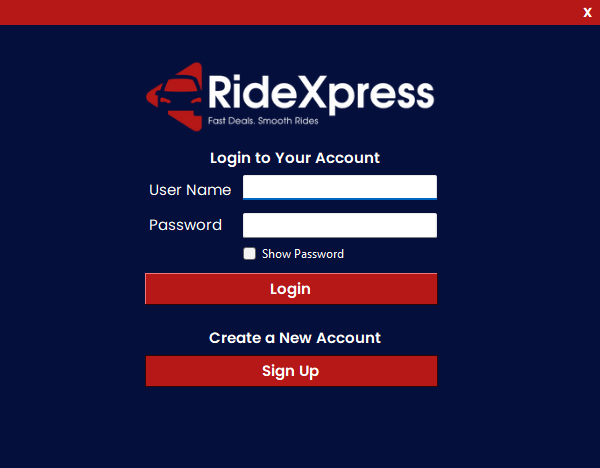
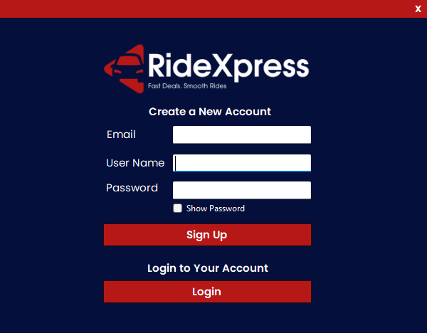
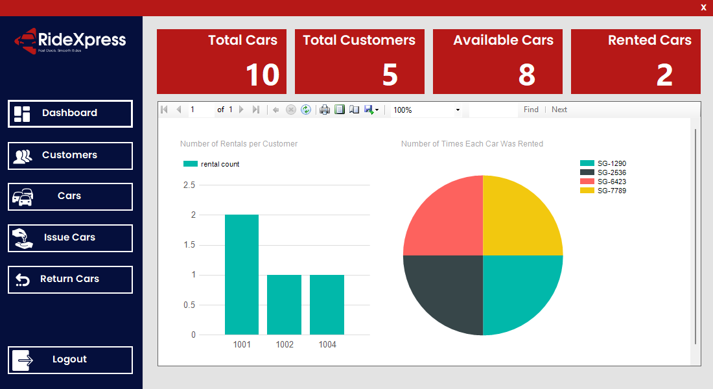
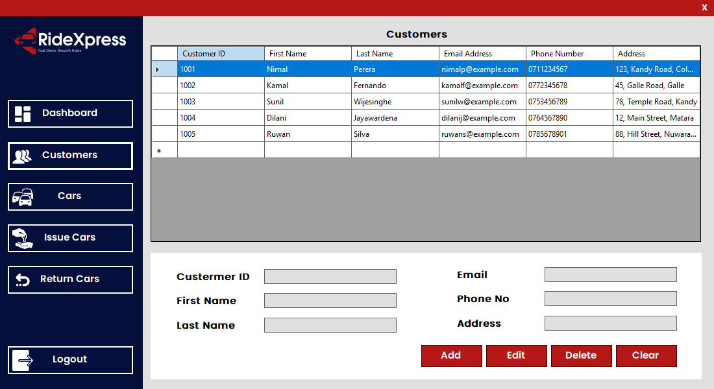
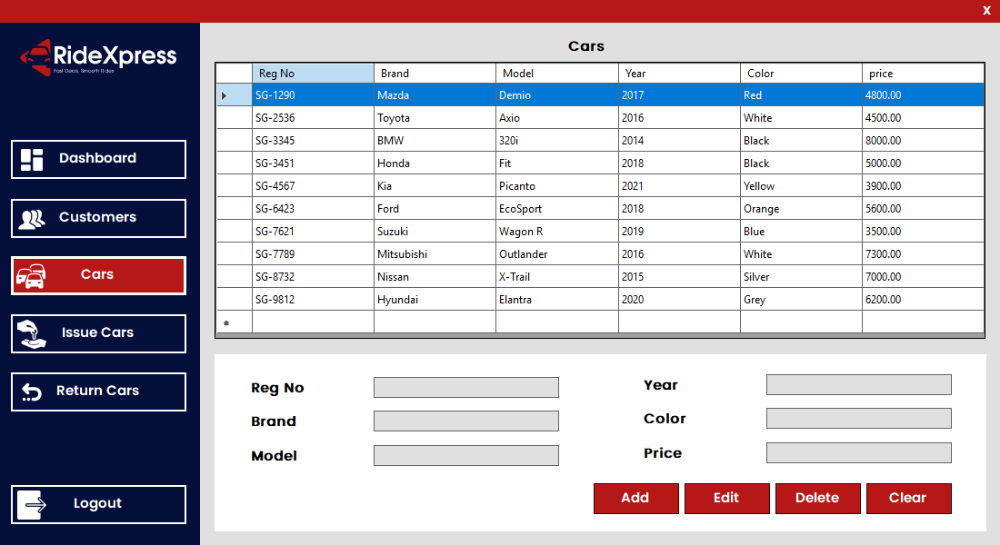
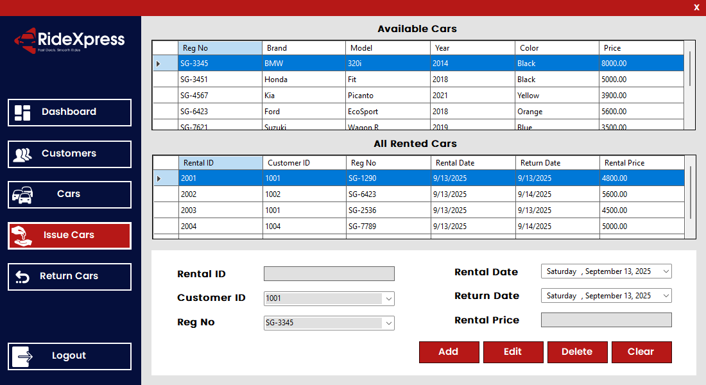
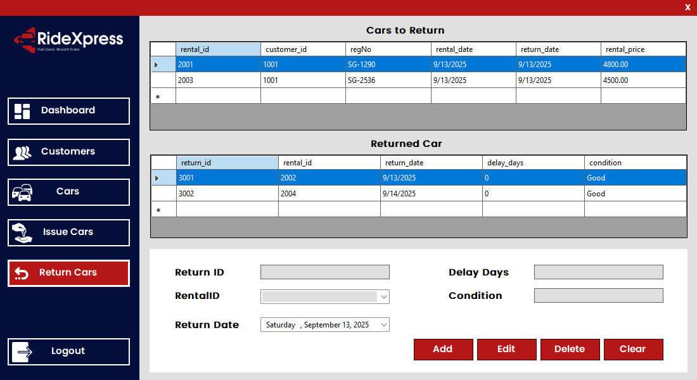

# RideXpress – Car Rental Management System

🚗 **RideXpress** is a Car Rental Management System developed as part of the **Visual Programming module** using **.NET Framework (C#)**, **MS SQL Server**, and **RDLC Reports**.

---

## Features

- Dashboard with interactive **RDLC reports**
- Customer management
- Car registration and management
- Car issue & return functionalities

---

## What I Learned

Through this project, I gained hands-on experience in:

- Developing desktop applications with **C# and .NET Framework**
- Designing and integrating **MS SQL Server databases**
- Creating and embedding **RDLC reports** for reporting and analysis
- Enhancing **UI design** for usability and user experience

---

## Screenshots

<!-- Replace these with your screenshots -->
<!-- Row 1: Login and Sign Up side by side -->

  
  

<!-- Row 2: Dashboard -->

<!-- Row 3: Customer Management -->

<!-- Row 4: Car Management -->

<!-- Row 5: Issue Car -->

<!-- Row 6: Return Car -->

---

## Team Acknowledgement

🙏 **Special thanks** to **Nuwanshi Indeewari, Sasith Ranishka, and Ishadi Umeshika** for their support and teamwork throughout this project.

---

## GitHub Repository

[RideXpress – Car Rental System](https://github.com/GamikaJayawardana/CarRentalSystem-RideXpress-V3)

---

## Technologies Used

- **C#** (.NET Framework)
- **MS SQL Server**
- **RDLC Reports**
- **Visual Studio 2022**

